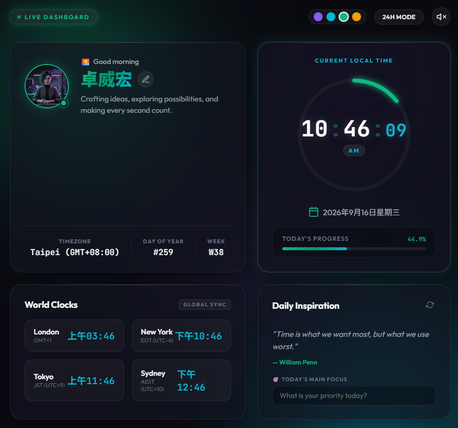

# 卓威宏 (Wesley Cho) | Personal Space & Live Clock Dashboard

> 🌐 **Live Website**: [https://wesley0628c.github.io/DIC1_PersonalPage/](https://wesley0628c.github.io/DIC1_PersonalPage/)  
> 📦 **GitHub Repository**: [https://github.com/Wesley0628c/DIC1_PersonalPage](https://github.com/Wesley0628c/DIC1_PersonalPage)  
> 👤 **Author**: 卓威宏 (Wesley Cho)

A modern, high-aesthetic personal dashboard and live clock web application featuring glassmorphism design, real-time widgets, day progress tracker, world clocks, ambient audio, and interactive themes.

<p align="center">
  
</p>

## ✨ Features

- 🕒 **Precision Live Clock**: Millisecond-accurate digital clock with 12H/24H format toggle.
- 📅 **Interactive Calendar & Day Progress**: Real-time percentage tracking of today, this month, and this year.
- 🌍 **World Clock Integration**: Track multiple time zones seamlessly.
- 🎨 **Multi-Theme Engine**: Switch between Violet, Cyan, Emerald, and Amber color palettes with ambient glow effects.
- 🎵 **Ambient Focus Audio**: Built-in sound generator for focus sessions.
- 📱 **Fully Responsive**: Optimized for desktop, tablet, and mobile displays.

## 🚀 Getting Started

Simply open `index.html` in any modern web browser, or serve with a static server:

```bash
# Using Python
python -m http.server 3000

# Using Node.js (npx)
npx serve .
```

## 🛠️ Tech Stack

- **HTML5** (Semantic structure)
- **Vanilla CSS** (Custom CSS variables, Glassmorphism, Micro-animations)
- **Vanilla JavaScript** (Zero external runtime dependencies)
